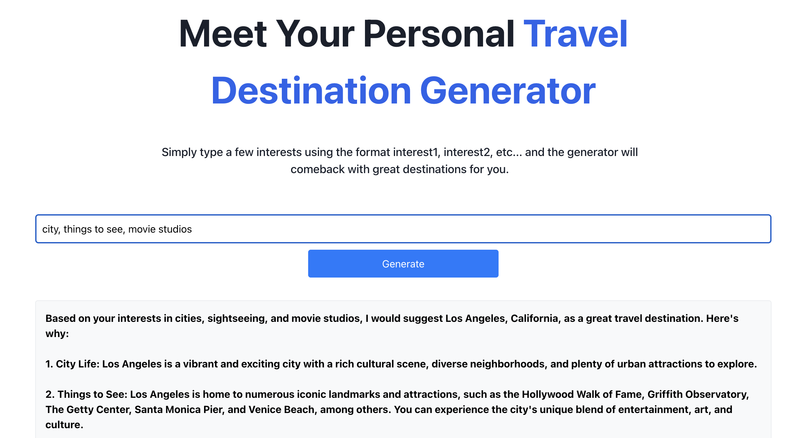

# Travel Destination Generator


## Overview

A serverless web application that leverages AWS services and Anthropic's Claude 3 Sonnet model (via Amazon Bedrock) to create personalized travel destination recommendations based on user interests. This project demonstrates end-to-end data engineering with a Git-based CI/CD workflow through AWS Amplify for building, deploying, and hosting a React application with a serverless backend.

)
*Initial application interface*


*Example of interest inputs and destination recommendations*

## Architecture

This application follows a modern cloud-native architecture based on AWS Amplify, AWS AppSync, and Amazon Bedrock:
 

## Project Implementation Tasks

This project was developed following a structured approach with the following key tasks:

### Task 1: Host a Static Website
- Configured AWS Amplify for Git-based CI/CD workflow
- Created and deployed a React application
- Established continuous deployment with automatic updates on code commits
- Deployed to a globally available CDN on an amplifyapp.com domain

### Task 2: Manage Users
- Configured authentication using AWS Amplify Auth (powered by Amazon Cognito)
- Set up user registration, authentication, and account recovery
- Enabled access to Amazon Bedrock and Claude 3 Sonnet foundation model

### Task 3: Build a Serverless Backend
- Created AWS Lambda functions for serverless processing
- Designed functions to generate prompts from user interests
- Implemented direct integration with Amazon Bedrock for Claude 3 Sonnet model
- Set up HTTP POST requests to the Claude model via the messages API

### Task 4: Deploy the Backend API
- Configured a custom GraphQL API using AWS AppSync
- Created custom queries to reference the data source
- Implemented resolvers to process data between frontend and backend
- Structured response types for Amazon Bedrock interactions

### Task 5: Build the Frontend
- Integrated Amplify UI component library for user authentication
- Implemented sign-up, sign-in, and password reset flows
- Connected to the GraphQL API for backend communication
- Created an intuitive user interface for entering interests and displaying results

## Key Technical Features

### Data Engineering Pipeline
- **Data Collection**: User interests captured through a responsive React interface
- **Data Validation**: Input validation and preprocessing before API transmission
- **Data Transformation**: AWS Lambda processes user inputs into AI-compatible prompts
- **Parallel Processing**: Efficiently handles multiple requests using serverless architecture
- **GraphQL Integration**: Uses AppSync to create a robust data layer between frontend and AI services

### Cloud Infrastructure
- **Serverless Architecture**: Fully serverless implementation using AWS services
- **Authentication**: Secure user management with Amazon Cognito
- **CI/CD Pipeline**: Automated Git-based workflow for continuous deployment
- **Global CDN**: Content delivery network for optimized global performance

### AI Integration
- **Bedrock Integration**: Leverages Amazon Bedrock for accessing Claude 3 Sonnet
- **Prompt Engineering**: Crafts effective prompts from user interests for optimal AI responses
- **Structured Data Handling**: Transforms unstructured AI responses into formatted travel recommendations

## Data Engineering Insights

This project demonstrates several key data engineering principles:

1. **ETL Pipeline**: Extracts user interests, transforms them into optimized prompts, and loads AI-generated content for display
2. **Data Flow Architecture**: Implements a GraphQL-based data flow with AWS AppSync for efficient data handling
3. **AI Integration**: Demonstrates effective integration with foundation models for data transformation
4. **Authentication Management**: Incorporates secure user authentication as part of the data flow
5. **Serverless Processing**: Utilizes event-driven architecture for efficient resource utilization
6. **CI/CD Data Pipeline**: Implements continuous integration and delivery for both application code and data processes

## Getting Started

### Prerequisites
- AWS Account with administrator-level access
- Node.js and npm installed
- AWS CLI configured with appropriate credentials
- GitHub account for CI/CD integration

### Deployment
The application leverages AWS Amplify's Git-based workflow for deployment:

1. Create a new React application:
```bash
npx create-react-app travel-destination-generator
cd travel-destination-generator
```

2. Connect to GitHub and push your code:
```bash
git init
git add .
git commit -m "Initial commit"
git remote add origin https://github.com/yourusername/travel-destination-generator.git
git push -u origin main
```

3. Set up AWS Amplify hosting:
   - Log in to the AWS Management Console
   - Navigate to AWS Amplify
   - Choose "Host web app"
   - Connect to your GitHub repository
   - Follow the guided deployment steps

4. Configure authentication and backend:
```bash
amplify init
amplify add auth
amplify add api
amplify push
```

### Local Development
```bash
# Install dependencies
npm install

# Start the local development server
npm start
```

## Future Enhancements

- Integration with travel APIs for real-time pricing and availability data
- Implementation of user feedback loop to improve recommendation quality over time
- Addition of personalized recommendations based on user history and preferences
- Expansion of the GraphQL schema to support more complex travel planning features
- Development of an admin dashboard for monitoring usage patterns and popular destinations
- Implementation of content moderation on user inputs using AWS AI services
- Integration with mapping services to visualize recommended destinations
